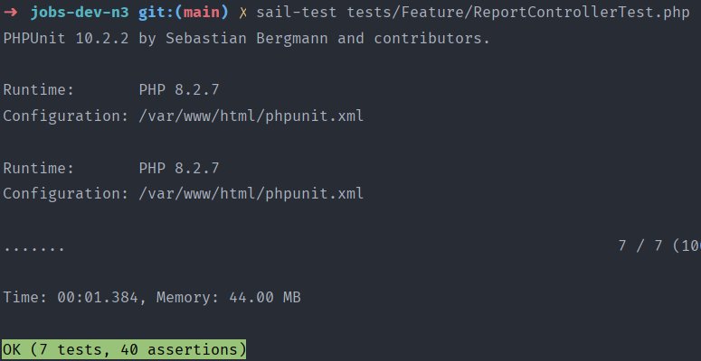

# StarGrid – Teste Desevolvedor(a) Backend N3

# Rodar o projeto localmente
- Execute os dois comandos abaixo estando na pasta raiz do projeto e com Docker instalado
```shell
 chmod +x start.sh  
 ./start.sh
```
Isso vai subir os containers e com acesso à api pelo *localhost:8080*
## Meu raciocínio inicial

Assim que clonei o projeto e li o readme, analisei no seguinte fluxo: 
- Vi que o projeto usa Laravel 7 e para usarmos as melhores ferramentas possíveis, vou migrar o projeto para laravel 10 e PHP 8.2. 
1. As rotas que existem e ao que elas levam. Vi que podem ser simplificadas com o metodo apiResource e logo vejo uma melhoria.
2. O código dentro dos Controllers, onde as funções não estão no padrão REST do laravel e com code smell de implementações que podem ser mais manuteníveis e limpas.  
3. Vejo que a responsabilidade da função de listar os Reports acaba criando um registro de um Report no banco, o que não deveria acontecer.

## Como eu agi:

1. Migrar o projeto para Laravel 10 conforme a documentação
- 7 para 8 https://laravel.com/docs/8.x/upgrade#upgrade-8.0
- 8 para 9 https://laravel.com/docs/9.x/upgrade
- 9 para 10 https://laravel.com/docs/10.x/upgrade

2. Ao instalar o laravel sail, percebi que o projeto não tem um .env e nem mesmo um .env.example. Adicionei os dois ao projeto.

3. Criei a migration de acordo com readme
4. Vi que os models não estão na pasta que deveriam e está vazio. Ajustei o namespace e criei os campos:
Antes:
```php
<?php

namespace App;

use Illuminate\Database\Eloquent\Model;

class Report extends Model
{
    //
}
```
Depois:
```php
<?php

namespace App\Models;

use Carbon\Carbon;
use Illuminate\Database\Eloquent\Factories\HasFactory;
use Illuminate\Database\Eloquent\Model;

/**
 * @property int $id
 * @property int $external_id
 * @property string $title
 * @property string $url
 * @property string $summary
 * @property Carbon $created_at
 * @property Carbon $updated_at
 */
class Report extends Model
{
    use HasFactory;

    protected $fillable = [
        'external_id',
        'title',
        'url',
        'summary',
    ];
}
```
5. Vi que não existe também um ReportFactory, então fiz também para acompanhar nos meus testes e prosseguir com TDD. Está em *database/factories/ReportFactory.php*
6. Percebi alguns erros por conta de nomenclatura de libs após a atualização e fiz alguns fix no projeto para trabalhar.
7. Agora vou começar a escrever os testes em *tests/Unit/ReportControllerTest.php*. Escrevi todos os casos do meu interesse e depois preenchendo as funções.
8. E agora vou começar o TDD, ajustando o arquivo de rotas para um apiResource e ajustando as funções no controller.
9. No meio dos testes, vi que a requisição não estava sendo feita corretamente, então logo fui ver a documentação da api e a v2 que fazem requisições não existe. Atualizei a url para a v4.
10. Ainda na mesma função, vi que a responsabilidade de listar o report não estava totalmente isolada, criando reports sem validação, podendo até mesmo criar reports duplicados dentro do nosso banco de dados. Tomei a decisão de engenharia de deixar a função de listar reports para apenas listar os reports existentes no banco de dados, já que mesmo sendo um middlware de uma api, há no projeto base uma função de criar e persistir no banco. Além disso, vou fazer uma função para criar vários reports no banco de dados de acordo com um filtro na request.

